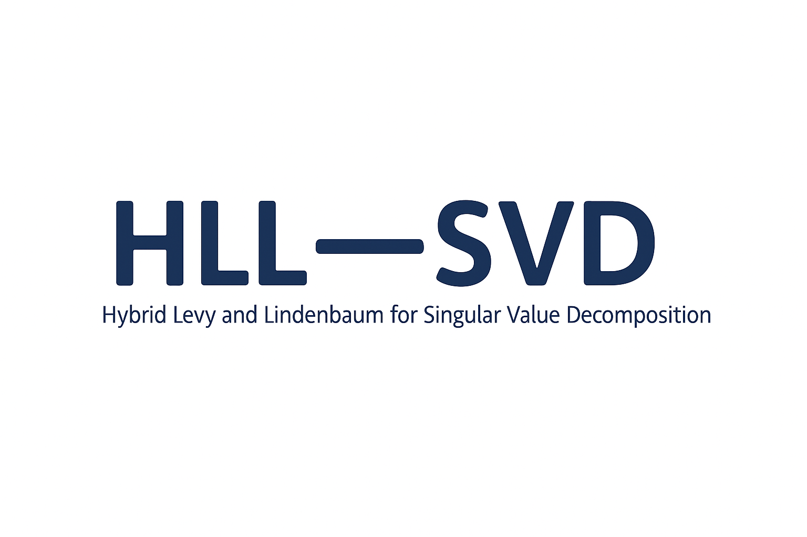
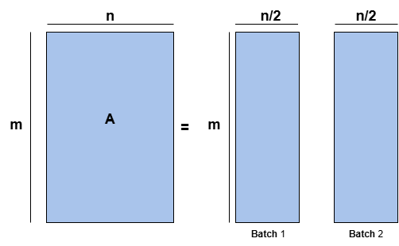
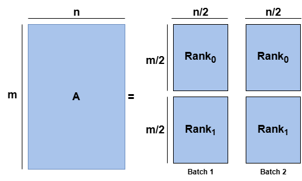

<p align="center">
  
  <br/>
  <a href="LICENSE"></a>
  <a href="#"></a>
  <a href="#"></a>


</p>


## Table of contents


  * [Description](#description)
  * [Installation](#Installation)
  * [Preprocessing](#Preprocessing)
  * [Testing](#Testing)
  * [References](#references)
  * [License](#license)


# Description
Our library provides a comprehensive set of methods for computing the Singular Value Decomposition (SVD), available in both sequential and parallel versions. Designed in a modular and well-structured manner, it ensures simple, flexible, and easily portable usage across various computing environments, including distributed architectures and GPU-accelerated systems. The library allows:

1. **Streaming SVD**: Our library provides the first implementation of the Levy and Lindenbaum([(Levy and Lindenbaum 1998)](#Levy-and-Lindenbaum-1998) approach on multiple  GPUs. We use mpi4py to enable inter-process communication in an HPC environment, and CuPy to perform algebraic operations (QR decomposition, SVD, matrix products, etc.) on GPUs;

2. **Direct Parallel SVD**: Our library provides a variety of direct methods for computing the SVD in parallel, including the approximate snapshot method [(Wang et al 2016)](#Wang-et-al-2016), snapshot method, and SVD via the TSQR method [(Wang et al 2016)](#Wang-et-al-2016). These methods use mpi4py to enable communication between processes running on different cores.


3. **Serail SVD**: The library provides a serial implementation of the Levy and Lindenbaum method, as well as other classical approaches for computing the SVD in serial, such as SVD via QR decomposition, SVD via EVD, and randomized SVD.

# Installation
Use the following command to install the library locally<br>
```bash
$ git clone "https://github.com/YassinAJANIF/HLL-SVD.git"
```
**Requirement**:
To run the library, you must have a Conda environment and libraries such as NumPy, CuPy, HDF5,mpi4py...., All requirement are in  the file "requirements.txt", to do so, please run the file:
```bash
python3 setup.py
```

## Installation in a brand new environment
In a new conda/mamba environment e.g. `par_svd` run the following command

```bash
$ (par_svd) mamba install --file requirements.txt -y
...
Executing transaction: done
$ (par_svd) pip install .
Successfully installed nom_du_projet-1.0.0
```
# Testing installation
### Generating test data
To generate the data, there are two directories:

- **/Data/Data_serial** contains the **script split_data_serial.py** for generating test data for the serial implementation. Specify the matrix dimensions (rows and columns) and the number of batches (num_batches). The data are partitioned column-wise into num_batches; Figure 1 shows the case num_batches = 2.”
```bash
$ python3 split_data_serial.py
```

<p align="center">
  
  <br/>
  <strong>Figure 1:</strong> Column-wise data partitioning for the serial version (example with num_batches = 2) .
</p>


- **/Data/Data_parallel**: contains the script **split_data_parallel.py** for generating test datasets for parallel implementations. Specify the matrix dimensions, the number of batches (num_batches), and the number of MPI ranks (num_ranks). Figure 2 illustrates the case with two batches and two MPI ranks..
<p align="center">
  
   <br/>
  <strong>Figure 2:</strong>  Column-wise batching (n/2) and row-wise split across two MPI ranks (m/2).
</p>


### Serial test
 For the serial version, once the data is ready, please run the following script:


```bash
$ python3 main_serial.py
```

### Parallel test


#### Running SVD with cupy+mpi4py(hybrid version)

- For the GPUs  version, if you are working in interactive mode, you can run the following command — for example, with 4 GPUs.


```bash
$ mpirun -np 4 python3 main_parallel_gpu.py
```
Otherwise, you can run the code using the Slurm script job_gpus.sh: 

```bash
$ SBATCH  job_gpus.sh
```


## References

#### (Levy and Lindenbaum 1998) 
*Sequential Karhunen–Loeve Basis Extraction and its Application to Images.* [[DOI](https://ieeexplore.ieee.org/abstract/document/723422)]

#### (Wang et al 2016) 
*Approximate partitioned method of snapshots for POD.* [[DOI](https://www.sciencedirect.com/science/article/pii/S0377042715005774)]

#### (Benson et al 2013)
*Direct QR factorizations for tall-and-skinny matrices in MapReduce architectures.* [[DOI](https://ieeexplore.ieee.org/document/6691583)]

#Lien utils
 

